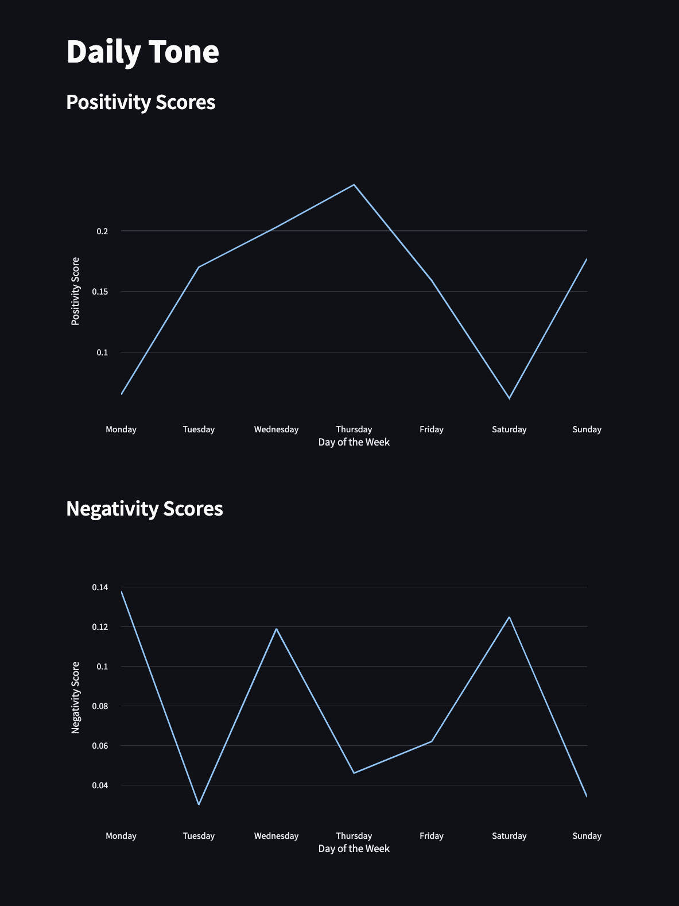

# Mood Visualizer

 

## <u>Table of Contents</u>

1. [Description](#Description)
2. [Usage](#Usage)
3. [Contributing](#Contributing)
4. [Authors](#Authors)
5. [License](#License)

## Description

Mood visualizer is a website that analyses your daily thoughts input and determines how positive and negative the input
was. It then takes your positivity and negativity scores for the week and plots it in a line graph for you to see.

The Daily Thoughts page allows the user to select a day of the week and then input their thoughts. This will update the
analysis backend and change the graph according to the new sentiment score determined. This allows the user to come back
every day and input their thoughts and see how they are feeling over the week.

### Dependencies

This project uses a number of standard and third party modules to achieve its functionality

#### Standard Modules

```glob```

#### Third Party Modules

```nltk```

- Used to perform sentiment analysis on the thoughts text
- The sentiment module in used in particular, with the SentimentIntensityAnalyzer class being used to perform the
  functionality
- Learn more about nltk by clicking [here](https://www.nltk.org/)
- Learn more about the SentimentIntensityAnalyzer
  class [here](https://www.nltk.org/api/nltk.sentiment.SentimentIntensityAnalyzer.html?highlight=sentimentintensity#nltk.sentiment.SentimentIntensityAnalyzer)

```streamlit```

- Used to created to client side frontend
- Learn more about streamlit by clicking [here](https://docs.streamlit.io/)

```plotly```

- Used to create the objects needed by streamlit to display graphs on the webpage
- The express module is used in particular
- Learn more about plotly.express by clicking [here](https://plotly.com/python/plotly-express/)

## Usage

To use this application, visit the application URL
[here](https://charanvir-mood-visualizer--main-qt2sq5.streamlit.app/)



## Contributing

We are always looking to improve your application and code, so if you wish to contribute, please create a repository and
push all changes you make to it. Then email me at charanvir123@gmail.com, and I will try to get back to you after I have
reviewed the code.

## Authors

To view more projects visit my [GitHub](https://github.com/Charanvir) account.

Direct any additional questions you have regarding this application to charanvir123@gmail.com

# License

The following application is covered under the MIT License.